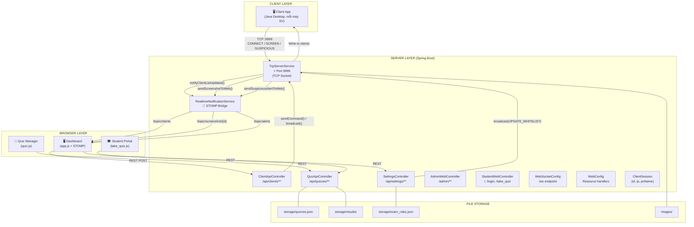
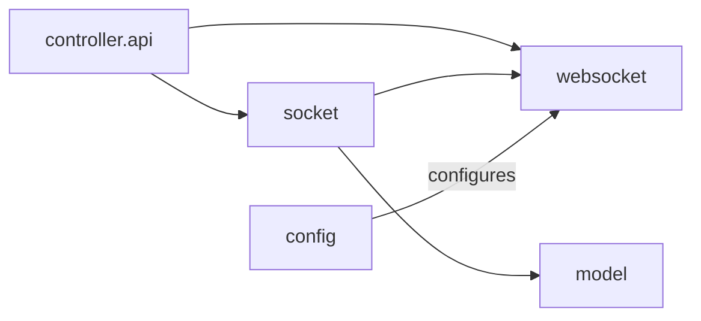
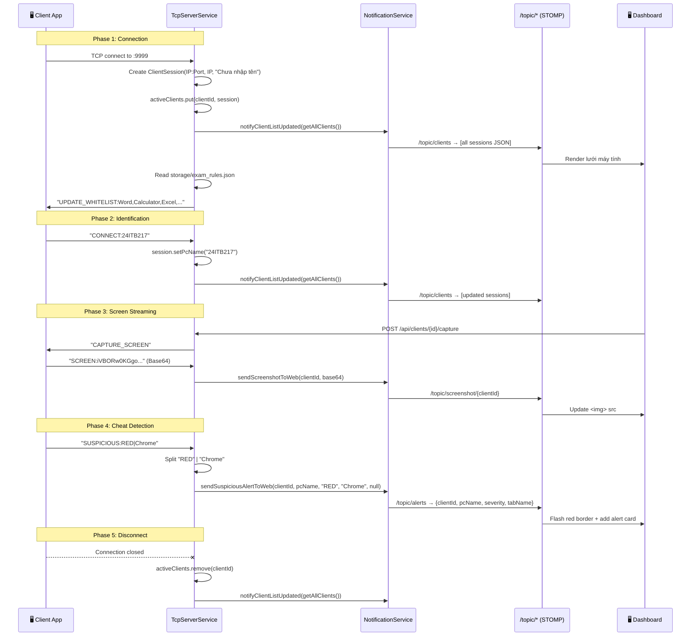
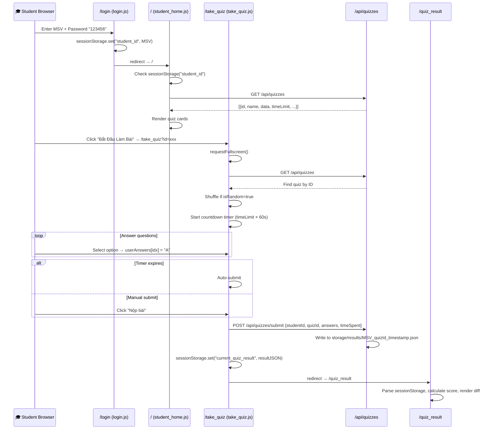
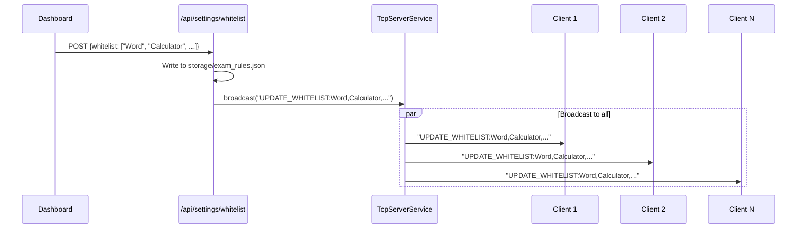
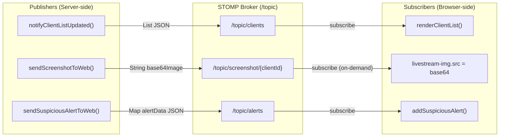
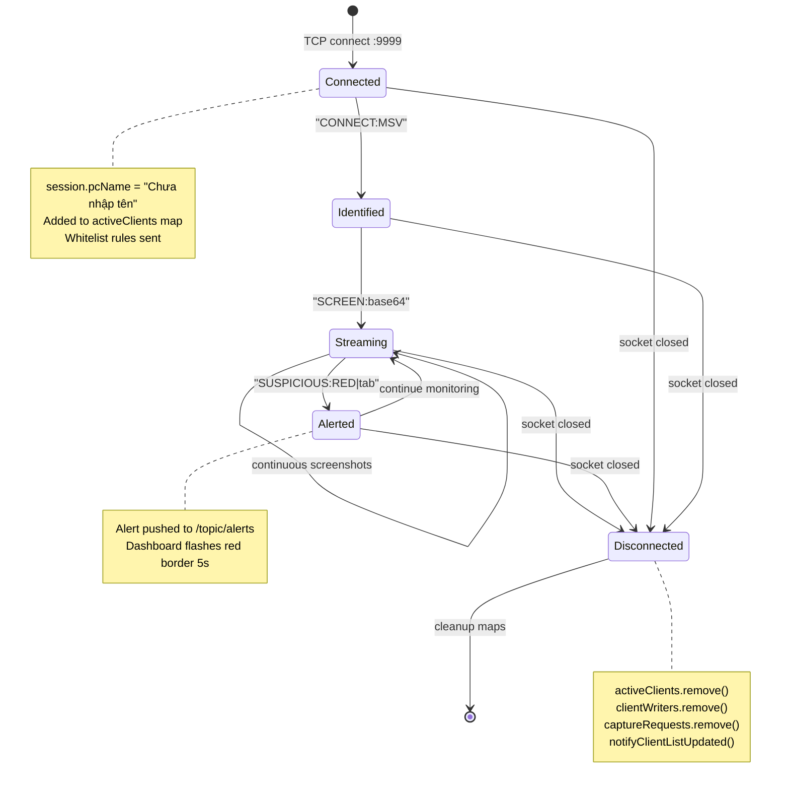

# 🔬 LAN Monitor Server — Deep-Dive Codebase Analysis

> **Project**: `com.vku.lanmonitor:lan-server` v0.0.1-SNAPSHOT
> **Stack**: Spring Boot 4.1.1 · Java 17 · WebSocket (STOMP) · Thymeleaf · Lombok · Jackson
> **Generated**: 2026-09-28

---

## 📁 BƯỚC 1 — File Inventory & Index

### Java Source Files (8 files)

| # | File | Package | LOC | Role |
|---|------|---------|-----|------|
| 1 | [`LanServerApplication.java`](file:///c:/Users/xuanvinh/Downloads/lan-server/src/main/java/com/vku/lanmonitor/server/LanServerApplication.java) | `server` | 14 | 🚀 Entry Point — `@SpringBootApplication` |
| 2 | [`TcpServerService.java`](file:///c:/Users/xuanvinh/Downloads/lan-server/src/main/java/com/vku/lanmonitor/server/socket/TcpServerService.java) | `server.socket` | 160 | 💓 **Heart** — TCP Socket Server on port 9999 |
| 3 | [`RealtimeNotificationService.java`](file:///c:/Users/xuanvinh/Downloads/lan-server/src/main/java/com/vku/lanmonitor/server/websocket/RealtimeNotificationService.java) | `server.websocket` | 44 | 📡 WebSocket push bridge (STOMP) |
| 4 | [`ClientSession.java`](file:///c:/Users/xuanvinh/Downloads/lan-server/src/main/java/com/vku/lanmonitor/server/model/ClientSession.java) | `server.model` | 16 | 📦 Data model (`id`, `ipAddress`, `pcName`) |
| 5 | [`WebSocketConfig.java`](file:///c:/Users/xuanvinh/Downloads/lan-server/src/main/java/com/vku/lanmonitor/server/config/WebSocketConfig.java) | `server.config` | 26 | ⚙️ STOMP broker config (`/topic`, `/ws`) |
| 6 | [`WebConfig.java`](file:///c:/Users/xuanvinh/Downloads/lan-server/src/main/java/com/vku/lanmonitor/server/config/WebConfig.java) | `server.config` | 23 | ⚙️ Static resource mapping (`/images/**`, `/temp_images/**`) |
| 7 | [`ClientApiController.java`](file:///c:/Users/xuanvinh/Downloads/lan-server/src/main/java/com/vku/lanmonitor/server/controller/api/ClientApiController.java) | `server.controller.api` | 61 | 🎮 REST API — Client monitoring commands |
| 8 | [`QuizApiController.java`](file:///c:/Users/xuanvinh/Downloads/lan-server/src/main/java/com/vku/lanmonitor/server/controller/api/QuizApiController.java) | `server.controller.api` | 94 | 📝 REST API — Quiz CRUD & submission |
| 9 | [`SettingsController.java`](file:///c:/Users/xuanvinh/Downloads/lan-server/src/main/java/com/vku/lanmonitor/server/controller/api/SettingsController.java) | `server.controller.api` | 59 | ⚙️ REST API — Whitelist management |
| 10 | [`AdminWebController.java`](file:///c:/Users/xuanvinh/Downloads/lan-server/src/main/java/com/vku/lanmonitor/server/controller/web/AdminWebController.java) | `server.controller.web` | 26 | 🌐 Thymeleaf routes for admin |
| 11 | [`StudentWebController.java`](file:///c:/Users/xuanvinh/Downloads/lan-server/src/main/java/com/vku/lanmonitor/server/controller/web/StudentWebController.java) | `server.controller.web` | 28 | 🌐 Thymeleaf routes for students |

### Frontend Files (13 files)

| File | Size | Purpose |
|------|------|---------|
| [`app.js`](file:///c:/Users/xuanvinh/Downloads/lan-server/src/main/resources/static/js/app.js) | 10.9KB | Dashboard: WebSocket connect, livestream, whitelist, alerts |
| [`quiz.js`](file:///c:/Users/xuanvinh/Downloads/lan-server/src/main/resources/static/js/quiz.js) | 13.7KB | Admin quiz builder (CRUD, JSON import, image attach) |
| [`take_quiz.js`](file:///c:/Users/xuanvinh/Downloads/lan-server/src/main/resources/static/js/take_quiz.js) | 7.3KB | Student exam interface (timer, navigation, submit) |
| [`student_home.js`](file:///c:/Users/xuanvinh/Downloads/lan-server/src/main/resources/static/js/student_home.js) | 2.9KB | Student home: quiz list, auth guard |
| [`quiz_result.js`](file:///c:/Users/xuanvinh/Downloads/lan-server/src/main/resources/static/js/quiz_result.js) | 3.1KB | Results viewer with answer diff |
| [`login.js`](file:///c:/Users/xuanvinh/Downloads/lan-server/src/main/resources/static/js/login.js) | 668B | Login handler (sessionStorage) |
| [`toast.js`](file:///c:/Users/xuanvinh/Downloads/lan-server/src/main/resources/static/js/toast.js) | 2.5KB | Toast notification system (anti-spam) |
| [`dashboard.html`](file:///c:/Users/xuanvinh/Downloads/lan-server/src/main/resources/templates/dashboard.html) | 14.4KB | Admin monitoring dashboard |
| [`quiz.html`](file:///c:/Users/xuanvinh/Downloads/lan-server/src/main/resources/templates/quiz.html) | 10.4KB | Quiz management page |
| [`take_quiz.html`](file:///c:/Users/xuanvinh/Downloads/lan-server/src/main/resources/templates/take_quiz.html) | 9.7KB | Exam taking interface |
| [`student_home.html`](file:///c:/Users/xuanvinh/Downloads/lan-server/src/main/resources/templates/student_home.html) | 2.1KB | Student lobby |
| [`login.html`](file:///c:/Users/xuanvinh/Downloads/lan-server/src/main/resources/templates/login.html) | 2.9KB | Login page |
| [`quiz_result.html`](file:///c:/Users/xuanvinh/Downloads/lan-server/src/main/resources/templates/quiz_result.html) | 3.4KB | Result review page |

### Data / Storage

| Path | Purpose |
|------|---------|
| `storage/quizzes.json` | All quiz data (JSON file-based "DB") |
| `storage/results/*.json` | Submitted student answers |
| `storage/exam_rules.json` | Whitelist keywords for anti-cheat |
| `storage/quiz_images/` | Uploaded question images |
| `images/` | Captured cheat evidence screenshots |
| `temp_images/` | Temporary auto-captured images |

---

## 🏗️ BƯỚC 2 — Architecture Overview

### High-Level Architecture Diagram



### Entry Points (4 External Interfaces)

| # | Type | Entry Point | Handler |
|---|------|-------------|---------|
| 1 | **TCP Socket** | `:9999` | [`TcpServerService.startServer()`](file:///c:/Users/xuanvinh/Downloads/lan-server/src/main/java/com/vku/lanmonitor/server/socket/TcpServerService.java#L67-L82) |
| 2 | **WebSocket** | `/ws` (SockJS+STOMP) | [`WebSocketConfig`](file:///c:/Users/xuanvinh/Downloads/lan-server/src/main/java/com/vku/lanmonitor/server/config/WebSocketConfig.java#L22-L25) |
| 3 | **REST API** | `/api/clients/**`, `/api/quizzes/**`, `/api/settings/**` | 3 `@RestController` classes |
| 4 | **Web Pages** | `/`, `/login`, `/admin/**`, `/take_quiz`, `/quiz_result` | 2 `@Controller` classes → Thymeleaf |

### Package Dependency Map



---

## 🔍 BƯỚC 3 — Detailed Trace

### 3.1 — TCP Protocol Trace (Client ↔ Server)



### 3.2 — Livestream Mechanism (4 FPS Polling)

```mermaid
sequenceDiagram
    participant DASH as Dashboard (app.js)
    participant API as /api/clients/{id}/capture
    participant TCP as TcpServerService
    participant SV as Client App
    participant STOMP as /topic/screenshot/{id}

    DASH->>DASH: openLiveStream(clientId)
    DASH->>STOMP: Subscribe /topic/screenshot/{clientId}

    loop Every 250ms (setInterval)
        DASH->>API: POST /capture
        API->>TCP: sendCommand(clientId, "CAPTURE_SCREEN")
        TCP->>SV: "CAPTURE_SCREEN" (via PrintWriter)
        SV->>TCP: "SCREEN:{base64}" (via BufferedReader)
        TCP->>STOMP: sendScreenshotToWeb(clientId, base64)
        STOMP->>DASH: msg.body → .src = "data:image/jpeg;base64,..."
    end

    DASH->>DASH: closeLiveStream()
    DASH->>DASH: clearInterval()
```

> [!IMPORTANT]
> The livestream runs at **4 FPS** — the dashboard calls `POST /capture` every **250ms** via `setInterval`. Each call triggers a full TCP round-trip: `CAPTURE_SCREEN` command → screenshot capture → Base64 encode → TCP send → WebSocket broadcast.

### 3.3 — Quiz Exam Flow (Student Lifecycle)



### 3.4 — Whitelist Update Flow



---

## 📐 BƯỚC 4 — Call Graph & Data Flow Trees

### 4.1 — Complete Call Graph (Text Tree)

```
LanServerApplication.main()
└── SpringApplication.run()
    ├── TcpServerService (implements CommandLineRunner)
    │   └── run(args)
    │       └── new Thread(this::startServer).start()
    │           └── startServer()
    │               ├── new ServerSocket(9999)
    │               ├── Files.createDirectories("images")
    │               └── while(isRunning)
    │                   └── serverSocket.accept()
    │                       └── threadPool.execute(new ClientHandler(socket))
    │                           └── ClientHandler.run()
    │                               ├── new ClientSession(clientId, ip, "Chưa nhập tên")
    │                               ├── activeClients.put()
    │                               ├── clientWriters.put()
    │                               ├── notificationService.notifyClientListUpdated()
    │                               ├── Read storage/exam_rules.json → out.println("UPDATE_WHITELIST:...")
    │                               └── while(readLine)
    │                                   ├── "CONNECT:xxx" → session.setPcName() → notifyClientListUpdated()
    │                                   ├── "SCREEN:xxx"  → sendScreenshotToWeb()
    │                                   │                  └── if captureRequests → Files.write("images/cheat_*.jpg")
    │                                   └── "SUSPICIOUS:x|y" → sendSuspiciousAlertToWeb()
    │
    ├── RealtimeNotificationService
    │   ├── notifyClientListUpdated(clients)     → /topic/clients
    │   ├── sendScreenshotToWeb(clientId, base64) → /topic/screenshot/{clientId}
    │   └── sendSuspiciousAlertToWeb(...)          → /topic/alerts
    │
    ├── ClientApiController (@RestController /api/clients)
    │   ├── GET  /                   → tcpServer.getAllClients()
    │   ├── POST /{id}/capture       → tcpServer.sendCommand(id, "CAPTURE_SCREEN")
    │   ├── POST /{id}/alert         → tcpServer.sendCommand(id, "ALERT:msg")
    │   ├── POST /{id}/save-frame    → tcpServer.requestCapture(id)
    │   └── POST /open-images-folder → Desktop.getDesktop().open(new File("images"))
    │
    ├── QuizApiController (@RestController /api/quizzes)
    │   ├── POST /         → mapper.writeValue(storage/quizzes.json)
    │   ├── GET  /         → mapper.readValue(storage/quizzes.json)
    │   ├── POST /submit   → mapper.writeValue(storage/results/MSV_quiz_time.json)
    │   └── DELETE /image/{f} → File.delete(storage/quiz_images/f)
    │
    ├── SettingsController (@RestController /api/settings)
    │   ├── GET  /whitelist → Read storage/exam_rules.json (fallback: default list)
    │   └── POST /whitelist → Write storage/exam_rules.json + tcpServer.broadcast("UPDATE_WHITELIST:...")
    │
    ├── AdminWebController (@Controller /admin)
    │   ├── GET /           → redirect /admin/monitor
    │   ├── GET /monitor    → "dashboard" (Thymeleaf)
    │   └── GET /quizzes    → "quiz" (Thymeleaf)
    │
    └── StudentWebController (@Controller)
        ├── GET /login      → "login"
        ├── GET /           → "student_home"
        ├── GET /take_quiz  → "take_quiz"
        └── GET /quiz_result → "quiz_result"
```

### 4.2 — WebSocket Topics Map



### 4.3 — REST API Routes Map

```
/api
├── /clients
│   ├── GET    /                     → List<ClientSession>
│   ├── POST   /{clientId}/capture   → Send "CAPTURE_SCREEN" command
│   ├── POST   /{clientId}/alert     → Send "ALERT:{message}" command
│   ├── POST   /{clientId}/save-frame → Flag next screenshot for file save
│   └── POST   /open-images-folder   → Open OS file explorer
│
├── /quizzes
│   ├── GET    /                     → List all quizzes from JSON file
│   ├── POST   /                     → Save all quizzes to JSON file
│   ├── POST   /submit              → Save student submission
│   └── DELETE /image/{fileName}    → Delete quiz image file
│
└── /settings
    ├── GET    /whitelist            → Get current whitelist
    └── POST   /whitelist            → Save & broadcast whitelist

/admin
├── GET /                → redirect → /admin/monitor
├── GET /monitor         → dashboard.html
└── GET /quizzes         → quiz.html

/ (root)
├── GET /                → student_home.html
├── GET /login           → login.html
├── GET /take_quiz       → take_quiz.html
└── GET /quiz_result     → quiz_result.html
```

### 4.4 — State Machine: Client Lifecycle



---

## 🔎 BƯỚC 5 — Hardcoded Values & Magic Strings Inventory

### 5.1 — Network & Ports

| Value | Location | Line | Description |
|-------|----------|------|-------------|
| `9999` | [`TcpServerService.java`](file:///c:/Users/xuanvinh/Downloads/lan-server/src/main/java/com/vku/lanmonitor/server/socket/TcpServerService.java#L69) | 69 | 🔴 **TCP Server port** — hardcoded |
| `"/ws"` | [`WebSocketConfig.java`](file:///c:/Users/xuanvinh/Downloads/lan-server/src/main/java/com/vku/lanmonitor/server/config/WebSocketConfig.java#L24) | 24 | WebSocket endpoint |
| `"/topic"` | [`WebSocketConfig.java`](file:///c:/Users/xuanvinh/Downloads/lan-server/src/main/java/com/vku/lanmonitor/server/config/WebSocketConfig.java#L16) | 16 | STOMP broker prefix |
| `"/app"` | [`WebSocketConfig.java`](file:///c:/Users/xuanvinh/Downloads/lan-server/src/main/java/com/vku/lanmonitor/server/config/WebSocketConfig.java#L18) | 18 | STOMP app destination prefix |
| `"*"` | [`WebSocketConfig.java`](file:///c:/Users/xuanvinh/Downloads/lan-server/src/main/java/com/vku/lanmonitor/server/config/WebSocketConfig.java#L24) | 24 | 🔴 **CORS wildcard** — allows all origins |

### 5.2 — Timeouts & Intervals

| Value | Location | Line | Description |
|-------|----------|------|-------------|
| `250` ms | [`app.js`](file:///c:/Users/xuanvinh/Downloads/lan-server/src/main/resources/static/js/app.js#L205) | 205 | 🔴 Livestream polling interval (4 FPS) |
| `4000` ms | [`app.js`](file:///c:/Users/xuanvinh/Downloads/lan-server/src/main/resources/static/js/app.js#L51) | 51 | WebSocket reconnect delay |
| `5000` ms | [`app.js`](file:///c:/Users/xuanvinh/Downloads/lan-server/src/main/resources/static/js/app.js#L39) | 39 | Alert red flash duration |
| `1500` ms | [`toast.js`](file:///c:/Users/xuanvinh/Downloads/lan-server/src/main/resources/static/js/toast.js#L21) | 21 | Toast anti-spam debounce |
| `3500` ms | [`toast.js`](file:///c:/Users/xuanvinh/Downloads/lan-server/src/main/resources/static/js/toast.js#L64) | 64 | Toast auto-hide delay |
| `15` (minutes) | [`quiz.js`](file:///c:/Users/xuanvinh/Downloads/lan-server/src/main/resources/static/js/quiz.js#L15) | 15 | Default quiz time limit |
| `5` (minutes) | [`quiz.js`](file:///c:/Users/xuanvinh/Downloads/lan-server/src/main/resources/static/js/quiz.js#L91) | 91 | Minimum quiz time limit |

### 5.3 — Magic Strings (Protocol Commands)

| String | Direction | Location | Description |
|--------|-----------|----------|-------------|
| `"CONNECT:"` | Client → Server | [`TcpServerService.java:116`](file:///c:/Users/xuanvinh/Downloads/lan-server/src/main/java/com/vku/lanmonitor/server/socket/TcpServerService.java#L116) | Student ID registration prefix |
| `"SCREEN:"` | Client → Server | [`TcpServerService.java:120`](file:///c:/Users/xuanvinh/Downloads/lan-server/src/main/java/com/vku/lanmonitor/server/socket/TcpServerService.java#L120) | Screenshot data prefix (Base64 follows) |
| `"SUSPICIOUS:"` | Client → Server | [`TcpServerService.java:131`](file:///c:/Users/xuanvinh/Downloads/lan-server/src/main/java/com/vku/lanmonitor/server/socket/TcpServerService.java#L131) | Cheat alert prefix (format: `severity\|tabName`) |
| `"CAPTURE_SCREEN"` | Server → Client | [`ClientApiController.java:28`](file:///c:/Users/xuanvinh/Downloads/lan-server/src/main/java/com/vku/lanmonitor/server/controller/api/ClientApiController.java#L28) | Command to request screenshot |
| `"ALERT:"` | Server → Client | [`ClientApiController.java:34`](file:///c:/Users/xuanvinh/Downloads/lan-server/src/main/java/com/vku/lanmonitor/server/controller/api/ClientApiController.java#L34) | Warning message to student |
| `"UPDATE_WHITELIST:"` | Server → Client | [`SettingsController.java:52`](file:///c:/Users/xuanvinh/Downloads/lan-server/src/main/java/com/vku/lanmonitor/server/controller/api/SettingsController.java#L52) | Broadcast new allowed apps list |
| `"Chưa nhập tên"` | Internal | [`TcpServerService.java:102`](file:///c:/Users/xuanvinh/Downloads/lan-server/src/main/java/com/vku/lanmonitor/server/socket/TcpServerService.java#L102) | Default pcName before CONNECT |
| `"Máy Trạm"` | Internal | [`RealtimeNotificationService.java:35`](file:///c:/Users/xuanvinh/Downloads/lan-server/src/main/java/com/vku/lanmonitor/server/websocket/RealtimeNotificationService.java#L35) | Fallback pcName in alerts |
| `"RED"` | Protocol | [`readme.md`](file:///c:/Users/xuanvinh/Downloads/lan-server/readme.md) | Alert severity level |

### 5.4 — File System Paths

| Path | Location | Line | Description |
|------|----------|------|-------------|
| `"images"` | [`TcpServerService.java`](file:///c:/Users/xuanvinh/Downloads/lan-server/src/main/java/com/vku/lanmonitor/server/socket/TcpServerService.java#L73) | 73 | Cheat screenshot storage dir |
| `"storage"` | [`QuizApiController.java`](file:///c:/Users/xuanvinh/Downloads/lan-server/src/main/java/com/vku/lanmonitor/server/controller/api/QuizApiController.java#L21) | 21 | Quiz data root dir |
| `"storage/quizzes.json"` | [`QuizApiController.java`](file:///c:/Users/xuanvinh/Downloads/lan-server/src/main/java/com/vku/lanmonitor/server/controller/api/QuizApiController.java#L22) | 22 | Quiz file-based DB |
| `"storage/results/"` | [`QuizApiController.java`](file:///c:/Users/xuanvinh/Downloads/lan-server/src/main/java/com/vku/lanmonitor/server/controller/api/QuizApiController.java#L29) | 29 | Student answer submissions dir |
| `"storage/quiz_images/"` | [`QuizApiController.java`](file:///c:/Users/xuanvinh/Downloads/lan-server/src/main/java/com/vku/lanmonitor/server/controller/api/QuizApiController.java#L28) | 28 | Quiz question images dir |
| `"storage/exam_rules.json"` | [`SettingsController.java`](file:///c:/Users/xuanvinh/Downloads/lan-server/src/main/java/com/vku/lanmonitor/server/controller/api/SettingsController.java#L25) | 25 | Whitelist rules config |

### 5.5 — Authentication & Security

| Value | Location | Line | Risk |
|-------|----------|------|------|
| `"123456"` | [`login.js`](file:///c:/Users/xuanvinh/Downloads/lan-server/src/main/resources/static/js/login.js#L11) | 11 | 🔴 **Hardcoded password** — client-side only |
| `"GIAO_VIEN_THI_THU"` | [`quiz.js`](file:///c:/Users/xuanvinh/Downloads/lan-server/src/main/resources/static/js/quiz.js#L322) | 322 | Mock teacher ID for test mode |
| `"UNKNOWN"` | [`QuizApiController.java`](file:///c:/Users/xuanvinh/Downloads/lan-server/src/main/java/com/vku/lanmonitor/server/controller/api/QuizApiController.java#L65) | 65 | Default student ID fallback |
| `sessionStorage` | [`login.js`](file:///c:/Users/xuanvinh/Downloads/lan-server/src/main/resources/static/js/login.js#L13) | 13 | 🔴 **Auth stored in sessionStorage** — no server-side session |

### 5.6 — Default Whitelist

| Value | Location |
|-------|----------|
| `"Bài Thi Trắc Nghiệm"` | [`SettingsController.java:37`](file:///c:/Users/xuanvinh/Downloads/lan-server/src/main/java/com/vku/lanmonitor/server/controller/api/SettingsController.java#L37) |
| `"Word"` | Same |
| `"Calculator"` | Same |
| `"Excel"` | Same |

### 5.7 — STOMP Topic Strings

| Topic | Publisher | Subscriber |
|-------|-----------|------------|
| `"/topic/clients"` | `RealtimeNotificationService` | `app.js` → `renderClientList()` |
| `"/topic/screenshot/{clientId}"` | `RealtimeNotificationService` | `app.js` → `openLiveStream()` |
| `"/topic/alerts"` | `RealtimeNotificationService` | `app.js` → `addSuspiciousAlert()` |

### 5.8 — Screenshot File Naming Pattern

```
cheat_{IP}_{Port}_{timestamp}.jpg
Example: cheat_192.168.1.5_54321_1698307200000.jpg
```

Location: [`TcpServerService.java:127-128`](file:///c:/Users/xuanvinh/Downloads/lan-server/src/main/java/com/vku/lanmonitor/server/socket/TcpServerService.java#L127-L128)

### 5.9 — Submission File Naming Pattern

```
{studentId}_{quizId}_{timestamp}.json
Example: 24ITB217_1700123_1710999.json
```

Location: [`QuizApiController.java:69`](file:///c:/Users/xuanvinh/Downloads/lan-server/src/main/java/com/vku/lanmonitor/server/controller/api/QuizApiController.java#L69)

---

## ⚠️ Hotspots & Observations

> [!WARNING]
> ### Security Concerns
> 1. **No server-side authentication** — Password `"123456"` is checked client-side only in `login.js`. All API endpoints are unprotected.
> 2. **CORS wildcard `"*"`** — WebSocket accepts connections from any origin.
> 3. **No input validation** on TCP protocol — malformed messages could cause issues.
> 4. **File path traversal risk** — `DELETE /api/quizzes/image/{fileName}` doesn't sanitize `fileName`.

> [!WARNING]
> ### Scalability & Reliability
> 1. **File-based "database"** — `quizzes.json` stores all quizzes in a single file. Concurrent writes are not thread-safe.
> 2. **Unbounded thread pool** — `Executors.newCachedThreadPool()` creates unlimited threads per connected client.
> 3. **Silent exception swallowing** — `ClientHandler.run()` catches all exceptions with empty catch block (line 139).
> 4. **`Desktop.getDesktop().open()`** — Only works on GUI-enabled OS; will fail in headless/server deployments.

> [!NOTE]
> ### Design Notes
> - The system uses a **dual-channel architecture**: TCP for client monitoring + WebSocket/STOMP for admin dashboard — this is a clean separation.
> - Quiz data uses **file-based JSON storage** instead of a database — intentional for lightweight deployments.
> - The TCP protocol is **text-based with prefix parsing** — simple but effective for the use case.
